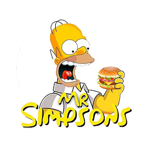

## Status ⌛

 

## Índice

- [Índice](#índice)
- [1. Introdução](#1-introdução)
- [2. Resumo do projeto](#2-resumo-do-projeto)
- [3. Paleta de cores](#3-paleta-de-cores)
- [4. Protótipo](#4-protótipo)
- [5. História de Usuário](#5-história-de-usuário)
- [6. Tecnologias Utilizadas](#6-tecnologias-utilizadas)
- [7. Como usar](#7-como-usar)
- [8. Desenvolvedoras](#8-desenvolvedoras)

 

 
## 1. Introdução

**Mr Simpsons** é uma pequena hamburgueria que está crescendo e para otimizar o atendimento foi desenvolvido uma interface para realizar os pedidos.

Você pode acessar a aplicação [AQUI](https://mr-simpsons.netlify.app/).

Para acessar, você pode utilizar o usuário e senha abaixo:

 

> | Usuário                 | Senha  |
> | ---------------------- | ------ |
> | atende@simpsons.com  | 123456 |

 

 

## 2. Resumo do projeto

**Mr Simpsons** tem uma interface em que se possa realizar pedidos utilizando um _tablet_, e enviá-los
para a cozinha para que sejam preparados de forma ordenada e eficiente.

Este projeto tem duas áreas: interface (cliente) e API (servidor). Nosso cliente nos pediu para desenvolver uma interface que se integre com a API.

Estas são as informações que temos do cliente:

> Somos **Mr Simpsons**, um fast food 24hrs.
>
>A nossa proposta de serviço 24 horas foi muito bem recebida e, para continuar a
>crescer, precisamos de um sistema que nos ajude a receber pedidos de nossos
>clientes.
>
>Nós temos 2 menus. Um muito simples para o café da manhã:
>
>| Ítem                      |Preço R$|
>|---------------------------|------|
>| Café americano            |    5 |
>| Café com leite            |    7 |
>| Sanduíche de presunto e queijo|   10 |
>| Suco de fruta natural     |    7 |
>
>E outro menu para o resto do dia:
>
>| Ítem                      |Preço |
>|---------------------------|------|
>|**Hambúrgueres**           |   **R$**   |
>|Hambúrguer simples         |    10|
>|Hambúrguer duplo           |    15|
>|**Acompanhamentos**        |   **R$**   |
>|Batata frita               |     5|
>|Anéis de cebola            |     5|
>|**Bebidas**                |   **R$**   |
>|Água 500ml                 |     5|
>|Água 750ml                 |     7|
>|Bebida gaseificada 500ml   |     7|
>|Bebida gaseificada 750ml   |    10|
>
> **Importante:** Os clientes podem escolher entre hambúrgueres de carne bovina,
> frango ou vegetariano. Além disso, por um adicional de R\$ 1,00 , eles podem
> adicionar queijo **ou** ovo.
>
>Nossos clientes são bastante indecisos, por isso é muito comum que eles mudem o
>seu pedido várias vezes antes de finalizar.
A interface mostra os dois menus (café da manhã e restante do dia), cada
um com todos os seus _produtos_. O usuário deve poder escolher que _produtos_
adicionar e a interface deve mostrar o _resumo do pedido_ com o custo total.

 

## 3. Paleta de Cores

 

## 4. Protótipo

Para criação dos Protótipos desenvolvido na ferramenta [Figma](https://www.figma.com/proto/5ZZ7yC1CMRTZYWDjNwMOrp/Figma-Basics?node-id=330%3A231&scaling=contain&page-id=0%3A286&starting-point-node-id=330%3A231).

## Tablet 

 

## 5. História de Usuário

## 6. Tecnologias Utilizadas
- HTML;
- CSS;
- ReactJS;
- Notion;
- Figma;
- NodeJS;
- Git e GitHub;
- Netlify;

 

## 7. Como usar

Você precisará usar o Node.js

Clonar o projeto

` $ git clone https://github.com/Tati-Mendonca/SAP007-burger-queen-api-client.git`

Instalar as dependências do projeto

` $ npm install or yarn`

Iniciar a aplicação

` $ npm start or yarn start`

Realizar os testes unitários

` $ npm test or yarn test`

Criar o aplicativo para produção

` $ npm run build or yarn build`

 

## 8. Desenvolvedoras
<table>
  <tr>
    <td>
      
      

        <a href="https://www.linkedin.com/in/julia-benedicto/" _blank>Julia Benedicto</a>
      

    </td>
    <td>
      
      

        <a href="https://www.linkedin.com/in/tati-mendonca/" _blank>Tatiane Mendonça</a>
      

    </td>
  </tr>
</table>

